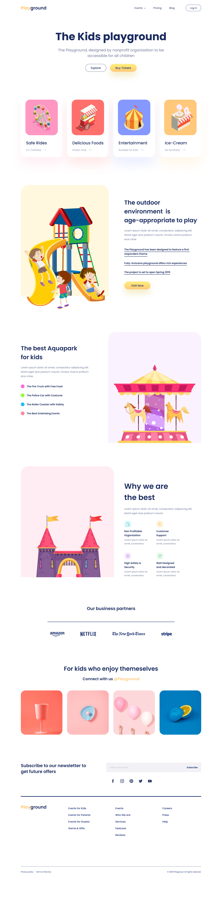

# Playground Landing Page



## Overview

This project is designed to help frontend developers practice and improve their skills in converting UI designs into fully functional web pages using pure HTML, CSS, and SCSS.

## Key Features

- **BEM Methodology**: Maintains a clean and scalable code structure
- **Atomic Design Principles**: Ensures modular and reusable component design
- **Semantic HTML**: Optimized for better SEO
- **Responsive Design**: Seamless user experience across various devices

## Tech Stack


- **HTML** – Webpage structure
- **CSS** – Styling and layout
- **SCSS** – Advanced styling with variables, nesting, and mixins

## Installation

1. Clone the repository

```bash
git clone https://github.com/tsthuy/cutting-ui-the-playground.git
```

2. Navigate to the project directory

```bash
cd playground-html-css-scss
```

3. Install dependencies

```bash
npm install
```

## Scripts

| Command              | Description                 |
| -------------------- | --------------------------- |
| `npm run build:sass` | Compile SCSS to CSS         |
| `npm run watch:sass` | Watch and auto-compile SCSS |

## Using Live Server

### Prerequisites

- Visual Studio Code
- Live Server Extension

### Steps to Use Live Server

1. Install the "Live Server" extension in VS Code:

   - Open VS Code
   - Go to Extensions (Ctrl+Shift+X)
   - Search for "Live Server"
   - Click "Install"

2. Launch the Project

   - Open the project folder in VS Code
   - Right-click on `index.html`
   - Select "Open with Live Server"

3. View Your Project
   - The project will automatically open in your default web browser
   - Any changes you make will auto-reload the page
